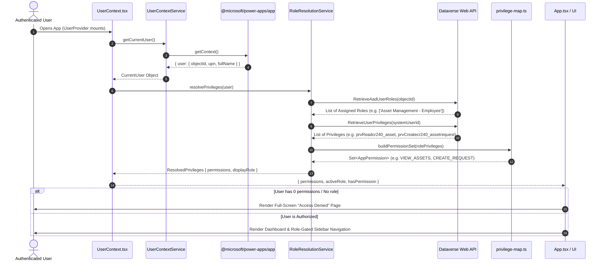

# Dataverse Role & Permission Handling Guide

A complete, beginner-friendly guide explaining how Role-Based Access Control (RBAC) works in this **Microsoft Power Apps Code App** using **Microsoft Dataverse** and **React / TypeScript**.

---

## 📖 1. Core Architecture & Concepts

### 1.1 The Golden Rule of Security in Power Platform Code Apps
> **Dataverse is the Single Source of Truth.**
> 
> The frontend application **never** creates roles, assigns roles, or stores role data in `localStorage`. All security roles and table permissions are managed in the **Power Platform Admin Center / Microsoft Entra ID**. The React frontend only **reads** the user's active permissions from Dataverse and adapts the UI accordingly.

```
┌────────────────────────────────────────────────────────┐
│  Power Platform Admin Center / Microsoft Entra ID      │
│  (Admin assigns Dataverse Security Roles to Users)     │
└───────────────────────────┬────────────────────────────┘
                            │ (Assigned at environment level)
                            ▼
┌────────────────────────────────────────────────────────┐
│  Microsoft Dataverse                                   │
│  - System Users & Teams                                │
│  - Security Roles & Table Privileges (prvRead*, prv*)  │
└───────────────────────────┬────────────────────────────┘
                            │ (Queried at app launch)
                            ▼
┌────────────────────────────────────────────────────────┐
│  React Power Apps Code App (Frontend)                  │
│  1. getContext()               → Get Entra User ID     │
│  2. RetrieveAadUserRoles       → Get Assigned Roles    │
│  3. RetrieveUserPrivileges     → Get Granular Rights   │
│  4. Privilege Mapping          → UI AppPermissions     │
│  5. Dynamic UI & Access Guard  → Navigation & Gates    │
└────────────────────────────────────────────────────────┘
```

---

## 👥 2. The 4 Dataverse Security Roles in this Solution

Your Dataverse solution contains these four predefined Security Roles:

| Security Role Name | Who it is for | What they can do |
| :--- | :--- | :--- |
| **`Asset Management - Employee`** | Standard End Users | View assets, submit hardware requests, view own requests. |
| **`Asset Management - Manager`** | Team Leads / Approvers | All Employee actions + Approve or Reject asset requests. |
| **`Asset Management - Asset Administrator`** | Asset / Inventory Managers | Full Hardware Lifecycle: create/edit assets, assign custody, manage maintenance. |
| **`Asset Management - IT Administrator`** | IT Ops / System Admins | Full control over the entire system, including Asset Categories and Facility Locations. |
| **`No Role Assigned`** | Users without solution roles | **Access Denied**: Blocked from app until admin assigns a role. |

---

## 🔄 3. Step-by-Step Code Execution Flow

When a user opens the application, the authorization flow runs in 5 distinct steps:



---

### Step 1: Discover Who is Logged In
📁 **File:** `src/auth/user-context.service.ts`

When running inside Power Apps, the `@microsoft/power-apps/app` SDK provides `getContext()`:
```typescript
import { getContext } from '@microsoft/power-apps/app';

const appCtx = await getContext();
const user = appCtx.user; // Contains objectId (Entra ID), userPrincipalName, fullName, tenantId
```
* **Why?** We don't ask the user to sign in or type their username. Power Apps securely provides the authenticated Entra ID identity.

---

### Step 2: Query Dataverse Security Roles & Privileges
📁 **File:** `src/auth/role-resolution.service.ts`

The service performs two targeted Dataverse API calls:
1. **`RetrieveAadUserRoles`**:
   Queries Dataverse for all security roles assigned to this Entra ID `objectId` (both directly assigned and team-inherited roles).
2. **`RetrieveUserPrivileges`**:
   Calls Dataverse's built-in function to get every single table privilege (e.g. `prvReadcr240_asset`, `prvWritecr240_assetrequest`) granted to the user.
* **Why?** In Dataverse, users can belong to Teams (e.g. an Entra Security Group or Owner Team) that grant roles. Querying Dataverse functions ensures we capture both **direct** and **team-inherited** permissions.

---

### Step 3: Map Dataverse Privileges to Application Permissions
📁 **File:** `src/permissions/privilege-map.ts`

Dataverse returns raw internal privilege strings like `prvReadcr240_asset`. The frontend translates them into clean TypeScript constants:

```typescript
export const DATAVERSE_PRIVILEGE_MAP = {
  prvReadcr240_asset: AppPermissions.VIEW_ASSETS,
  prvCreatecr240_asset: AppPermissions.CREATE_ASSET,
  prvWritecr240_asset: AppPermissions.UPDATE_ASSET,
  prvDeletecr240_asset: AppPermissions.DELETE_ASSET,
  prvCreatecr240_assetrequest: AppPermissions.CREATE_REQUEST,
  prvWritecr240_assetrequest: AppPermissions.UPDATE_REQUEST,
  // ...
};
```

* **Inferring Manager Approval Rights:**
  If a user has write privilege on requests (`prvWritecr240_assetrequest`), the mapper grants `AppPermissions.APPROVE_REQUEST` and `AppPermissions.REJECT_REQUEST`.

---

### Step 4: React State Distribution
📁 **Files:** `src/context/UserContext.tsx` & `src/hooks/usePermission.ts`

The resolved permissions are wrapped in a React Context so any component can check access easily:

```typescript
// In any component:
const { hasPermission, activeRole } = usePermission();

if (hasPermission(AppPermissions.CREATE_ASSET)) {
  // Show "Add Asset" button
}
```

---

### Step 5: Screen-Level & Component-Level Protection
📁 **Files:** `src/App.tsx`, `src/components/layout/Sidebar.tsx`, `src/components/layout/Header.tsx`

1. **App-Level Access Denied Guard (`App.tsx`):**
   If `permissions.size === 0` or `activeRole === 'No Role Assigned'`, the app immediately renders a full-page **Access Denied** message:
   > *"Your account does not have permission to access the Asset Management application. Please contact your Power Platform administrator to assign the appropriate security role."*

2. **Sidebar Navigation Filter (`Sidebar.tsx`):**
   Each menu link checks `visible: hasPermission(...)`. For example:
   - "Manager Approvals" is only visible if the user can approve/reject requests.
   - "Facility Locations" is only visible if the user has `MANAGE_LOCATIONS`.

3. **Header Security Badge (`Header.tsx`):**
   Displays the actual assigned Dataverse role (e.g. `Asset Management - Employee` or `Asset Management - IT Administrator`).

---

## 🔍 4. How to Debug Roles & Permissions (Step-by-Step)

If a user reports role or access issues, follow these debugging steps:

### Step 1: Open Developer Tools Console (`F12`)
Look for the `[RoleResolution]` console logs printed during app startup:

```text
[RoleResolution] Direct & Team Roles from Dataverse: ["Asset Management - Employee"]
[RoleResolution] Received 32 privileges: ["prvReadcr240_asset", "prvCreatecr240_assetrequest"]
[RoleResolution] Resolved permissions count: 3 assigned roles: ["Asset Management - Employee"] → final display role: Asset Management - Employee
```

### Step 2: Diagnostic Check Matrix

| Symptom | Cause | Where to Fix |
| :--- | :--- | :--- |
| **User sees "Access Denied" page** | User is not assigned any of the 4 security roles in Dataverse. | Go to **Power Platform Admin Center** → Environment → Users → Select user → **Manage Security Roles** → Assign role. |
| **User sees "Employee" but should be "Manager"** | The Manager security role was not assigned or the team membership hasn't synced yet. | Check user roles in Power Platform Admin Center. If assigned via an Entra Group Team, check Entra group membership. |
| **"Approvals" menu tab is missing** | User doesn't have `prvWritecr240_assetrequest` in their role privilege set. | Check table permissions for `cr240_assetrequest` in the Dataverse Security Role definition. |
| **Dataverse call returns 403 Forbidden** | UI allowed an action, but the server-side Dataverse role lacks table privilege. | Update table privileges in the Security Role in Power Platform Solution Explorer. |

---

## 💡 5. Why is it Built This Way? (Best Practices)

1. **Why not store roles in `localStorage`?**
   - Storing roles in `localStorage` is insecure because any user can edit local storage using browser developer tools.
2. **Why not use custom User/Role tables?**
   - Power Platform already has an enterprise-grade identity and security subsystem built into Dataverse. Using native Security Roles leverages Microsoft Entra ID, Azure AD Conditional Access, and environment-level governance without extra maintenance.
3. **Defense in Depth:**
   - **Frontend UI Gates** (`hasPermission`): Provide a clean, friendly user experience by hiding features the user cannot use.
   - **Backend Dataverse Security**: Enforces real security boundaries at the database/API level, preventing unauthorized CRUD requests regardless of frontend code.
